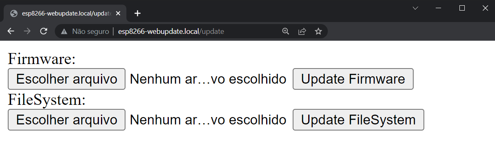

# ESP8266 Web Update
This code makes possible to update ESP8266 using a web server (OTA)

## main.cpp
Contains the minimum example for using this library, same as below:
```c++
#include "WebUpdate.h"

void setup() {
  WebUpdateSetup(192,168,15,199);
}

void loop() {
  WebUpdateLoop();
}
```

## Generated page


Click first button to find the **firmware.bin** file then click on **Update Firmware**  and wait for message asking for Reboot.
For projects that use FileSystem memory use, below you can upload filesystem and upload it.
## Notes:
  - Be sure, when building the file, that the generated file will **not use 50% or more of Flash and  RAM memories** (normally informated after building process on compiler). If this happens, you will not be able to upload new files and will receive **Error[4] - Not enough space**.
  - On platformio firmware.bin will be on folder: *ProjectFolder\.pio\build\espXX_XX*
  - The new code uploaded must have the functions above, if not, you will not be able to upload new files through this method.
